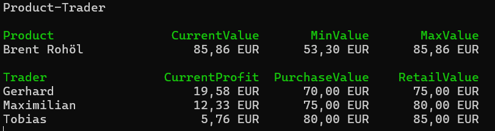

# POSE 5ABIF/5ACIF

## ProductTrader

**Lehrziele**

- Wie eine einfache Klassenstruktur aufgebaut wird (Vertiefung).
- Wie Objekten miteinander kommunizieren (Vertiefung).
- Wie Ereignisse (Events) zur Benachrichtigung von Veränderungen eingesetzt werden.
- Wie das Observer Pattern implementiert wird.

### Aufgabenstellung

Es ist eine kleine Simulation eines Produktes auf einen Handelsplatz zu simulieren. Dabei wird ein Produkt mit einem Namen und einem Startwert erzeugt. Nach der Erstellung des Produktes wird die Simulation mit der Methode `Start()` gestartet. Nachdem der Handel mit dem Produkt gestartet wurde, wird der aktuelle Wert des Produktes jede halbe Sekunde neu berechnet und die Trader (Händler) benachrichtigt. Der Änderungswert wird zufällig berechnet (im Bereich von +/- 1 % bis +/- 5 % vom aktuellen Wert). Beachten Sie dazu folgende Schnittstelle für das Produkt:

```csharp
public interface IProduct
{
    /// <summary>
    /// Gets the name of the stock.
    /// </summary>
    string Name { get; }

    /// <summary>
    /// Returns the maximum value the stock has had.
    /// </summary>
    double MaxValue { get; }

    /// <summary>
    /// Gets the current value of the stock.
    /// </summary>
    double Value { get; }

    /// <summary>
    /// Returns the minimum value the stock has had.
    /// </summary>
    double MinValue { get; }

    /// <summary>
    /// Fired when the value of the stock has changed.
    /// </summary>
    event EventHandler? Changed;

    /// <summary>
    /// Starts the simulation.
    /// </summary>
    void Start();

    /// <summary>
    /// Stops the simulation.
    /// </summary>
    void Stop();
}
```

**Hinweis:**
Die zufällige Berechnung kann wie folgt berechnet werden:

```csharp
Prozentsatz: Random.Next(0, 50) / 1000.0
int upOrDown = Random.Next(1, 101) >= 50 ? 1 : -1;
```

Das ist nur ein Vorschlag für die Berechnung des Produkt-Wertes. Mit der Eigenschaft `MinValue` kann das Minimum des Produktes abgefragt werden (analog dazu die Eigenschaft `MaxValue`). Mit der Eigenschaft `Value` kann der aktuelle Wert des Produktes abgefragt werden.

#### Broker

Ein Trader ist ein Produkt-Händler und achtet auf einen möglichst hohen Gewinn. Dieser Gewinn ergibt sich aus dem Kauf und Verkauf eines Produktes. Die Strategie ist, das Produkt ab einem bestimmten Wert (`PurchaseValue`) zu kaufen und ab einem bestimmten Wert (`RetailValue`) zu verkaufen. Aus der Differenz ergibt sich der Gewinn. Beachten Sie dazu die folgende Schnittstelle:

```csharp
public interface ITrader
{
    /// <summary>
    /// Returns the current profit.
    /// </summary>
    double CurrentProfit { get; }

    /// <summary>
    /// The broker's name. 
    /// </summary>
    string Name { get; }

    /// <summary>
    /// Gets the profit made so far.
    /// </summary>
    double PastProfit { get; }

    /// <summary>
    /// Gets the purchase value.
    /// </summary>
    double PurchaseValue { get; }

    /// <summary>
    /// Gets the retail value.
    /// </summary>
    double RetailValue { get; }

    /// <summary>
    /// Registration method for the share.
    /// </summary>
    /// <param name="sender">The share.</param>
    /// <param name="eventArgs">Not in use.</param>
    void UpdateProduct(object sender, EventArgs eventArgs);
}
```

**Hinweis:**
Der aktuelle Gewinn (Eigenschaft: `CurrentProfit`) berechnet sich aus dem bisherigen Gewinn (Eigenschaft: `PastProfit`) und falls der Trader gerade ein Produkt gekauft hat, den zusätzlichen Gewinn oder Verlust zwischen Kaufwert und aktuellem Wert. 

##### Fälle:

1. Trader hat das Produkt gekauft und der Wert des Produktes ist ≥ `RetailValue`:

    ```csharp
    PastProfit += product.Value - buyValue;
    CurrentProfit = PastProfit;
    ```

2. Broker hat nicht gekauft und der Wert der Aktie ≤ `PurchaseValue`:

    ```csharp
    buyValue = product.Value;
    CurrentProfit = PastProfit;
    ```

3. Sonst:

    ```csharp
    CurrentProfit = PastProfit;
    CurrentProfit += hasBought ? product.Value - buyValue : 0;
    ```

**Konsolen-Ausgabe:**



## Programm der Simulation

Das Programm für die Simulation startet wie folgt:

```csharp
/// <summary>
/// The main entry point for the application.
/// </summary>
static void Main(/*string[] args*/)
{
    Console.WriteLine("Product-Trader");

    Product product = new("Brent Rohöl", 68.41);
    Trader trader1 = new("Gerhard", 70, 75);
    Trader trader2 = new("Maximilian", 75, 80);
    Trader trader3 = new("Tobias", 80, 85);

    product.Changed += PrintHeader!;
    product.Changed += PrintProduct!;
    product.Changed += PrintTraderHeader!;
    product.Changed += trader1.UpdateProduct!;
    product.Changed += trader2.UpdateProduct!;
    product.Changed += trader3.UpdateProduct!;
    product.Start();
    Console.ReadLine();
    product.Stop();
}

/// <summary>
/// Prints the header information when the product changes.
/// </summary>
/// <param name="sender">The source of the event.</param>
/// <param name="e">The event data.</param>
static void PrintHeader(object sender, EventArgs e)
{
    Console.Clear();
    Console.WriteLine("Product-Trader");
    Console.WriteLine();
}

/// <summary>
/// Prints the product information when the product changes.
/// </summary>
/// <param name="sender">The source of the event.</param>
/// <param name="e">The event data.</param>
static void PrintProduct(object sender, EventArgs e)
{
    if (e is ProductEventArgs product)
    {
        ConsoleColor saveColor = Console.ForegroundColor;

        Console.ForegroundColor = ConsoleColor.Green;
        Console.WriteLine($"{"Product",-20} {"CurrentValue",14} {"MinValue",14} {"MaxValue",14}");
        Console.ForegroundColor = saveColor;
        Console.WriteLine($"{product.Name,-20} {product.Value,10:f} EUR {product.MinValue,10:f} EUR {product.MaxValue,10:f} EUR");
        Console.WriteLine();
    }
}

/// <summary>
/// Prints the trader header information when the product changes.
/// </summary>
/// <param name="sender">The source of the event.</param>
/// <param name="e">The event data.</param>
static void PrintTraderHeader(object sender, EventArgs e)
{
    if (e is ProductEventArgs product)
    {
        ConsoleColor saveColor = Console.ForegroundColor;

        Console.ForegroundColor = ConsoleColor.Green;
        Console.WriteLine($"{nameof(Trader),-20} {nameof(Trader.CurrentProfit),14} {nameof(Trader.PurchaseValue),14} {nameof(Trader.RetailValue),14}");
        Console.ForegroundColor = saveColor;
    }
}
```

**Viel Spaß!**
